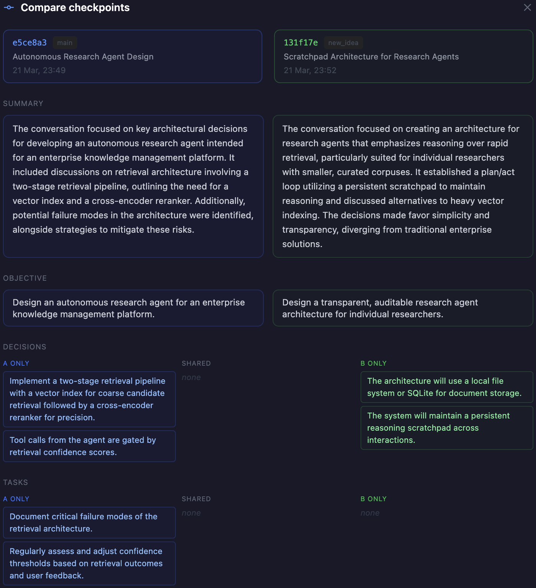

# Smriti

Version control for reasoning.

---

## Why I ended up building this

I was switching between ChatGPT, Claude, Cursor etc while working on problems, and something kept breaking.

Not the models. My own context.

I would spend 30-40 minutes figuring something out, reach a clean decision and then:

- switch models
- come back later
- try a different approach

and suddenly I had to reconstruct everything again.

Worse, sometimes the conversation itself would drift. I would keep adding messages, and eventually the model was building on confused or contradictory context. Once that happens, it is hard to recover. You either keep patching the thread or restart from scratch.

That is what pushed me to build this.

---

## The core idea

Instead of treating conversations as logs, treat the **state of reasoning** as something explicit and structured.

A **checkpoint** captures where you are:

- what you figured out
- decisions you made
- assumptions you are relying on
- what is still open
- what needs to be done
- artifacts you want to preserve (code, plans, key outputs)

When reasoning drifts or goes wrong, you can **restore to a clean checkpoint** and continue from there. The earlier conversation is excluded from context entirely. Not hidden, not summarized. Actually excluded at the data layer.

You can also **branch your thinking** from any checkpoint, explore a different direction, and later **compare** where the two paths diverged.

---

## Demo



*Comparing two checkpoints: one exploring retrieval-heavy architecture, the other a state-first approach. Smriti shows exactly where the decisions diverged.*

Watch demo (3-4 min):
https://www.loom.com/share/0531ab1b6f114ceb9996ec5780052158

---

## The problem

You spend an hour working through something. You finally reach clarity. Then you need to:

- step away and come back later
- switch to a different model
- revisit an earlier direction

And everything falls apart. There is no clean way to:

- return to that exact state of thinking
- branch thinking without messing up the original
- switch models without re-explaining everything
- recover from a conversation that went wrong

The more you work with multiple models and complex problems, the worse this gets.

**Reasoning state becomes the bottleneck.**

---

## What this lets you do

### Restore to a clean state

When a conversation drifts or gets polluted with bad context, restore to an earlier checkpoint. Pre-restore turns are visually dimmed and excluded from context. The model only sees the checkpoint state and your new messages.

### Branch your thinking

Fork from any checkpoint to explore a different direction. The original path stays untouched. Both branches live in the same space and can be compared.

### Compare where reasoning diverged

Side-by-side structured diff of any two checkpoints. See exactly which decisions differ, which assumptions changed, what questions were resolved differently.

### Review checkpoint consistency

Run a review on any checkpoint to surface reasoning issues: possible contradictions between decisions, hidden assumptions that should be explicit, open questions that were already resolved, and entities that are disconnected from the reasoning.

### Track assumptions separately from decisions

Assumptions are things your reasoning takes for granted. Decisions are explicit choices. Smriti keeps them separate because when reasoning goes wrong, you need to know whether a bad decision was made or whether it was built on an unexamined assumption.

### Attach real artifacts

Capture assistant responses, code snippets, plans, or other outputs directly into a checkpoint. When the checkpoint is active, these artifacts are included in the model's context. The reasoning is grounded in actual content, not just summaries of what was discussed.

### Switch models without losing state

Smriti owns the reasoning state. The model is just a rendering engine. Switch from GPT-4o to Claude to Llama mid-session without re-explaining anything.

---

## When to use Smriti

**Use it when:**

- you are working through something complex over multiple sessions
- you need to explore multiple approaches and compare them
- your conversation has drifted and you want to recover cleanly
- you are switching between models and need context continuity
- you want to preserve specific outputs alongside your reasoning state

**Probably not needed when:**

- quick one-shot questions
- simple tasks that don't involve evolving reasoning
- anything where context starts fresh each time

---

## One thing I did differently

Most systems rely on prompts to manage context. I didn't.

When you restore a checkpoint, I enforce boundaries in the data layer itself. Only the relevant turns are visible. Nothing from the future leaks in. Nothing from other sessions sneaks in.

It is stricter than typical chat systems. But it felt important to try.

---

## Smriti is a backend, not just a chat app

I initially built this thinking about chat, but the more I worked on it, the more it felt like a reasoning-state backend that happens to have a chat UI on top. Agents have the same drift / recovery / handoff problems as humans, just worse.

The concrete use case that drove this direction: working on a coding project and wanting to switch between different coding agents mid-project. Context reset every time. Markdown handoff files that broke down the moment reasoning branched. The strengths Smriti already had — checkpoints, restore, fork, compare, assumptions, artifacts, model interchangeability — mapped directly onto that pain.

So Smriti now has three surfaces on the same core:

1. **The chat UI**: how a human reads, steers, and debugs shared reasoning state. Still the primary way I inspect what is happening in a project.
2. **A CLI** (`smriti`): how a coding agent reads and writes the same reasoning state from a shell tool loop. Works from any host that can run a shell command.
3. **An MCP server** (`smriti-mcp`): the same surface, wrapped as 12 MCP tools for hosts that speak the Model Context Protocol natively (Claude Code, Cursor, Windsurf). Agents call `smriti_state`, `smriti_create_checkpoint`, `smriti_fork`, etc. as structured tool calls instead of shelling out.

One project, one Smriti Space, multiple agents reading from and writing to the same structured state. Agents don't need to know about each other. They just need to know how to read the current state and write a checkpoint when they reach an inflection point.

See `cli/README.md` for both surfaces. Quick taste:

```bash
smriti state my-project                                    # continuation brief
cat handoff.md | smriti checkpoint create my-project --extract   # structured commit from freeform markdown
smriti checkpoint review <id>                              # consistency check before handing off
smriti fork <id> --branch experiment                       # branch off a checkpoint
smriti compare <id-a> <id-b>                               # structured diff of two checkpoints
```

Or from inside Claude Code, after adding `smriti-mcp` to your MCP config: "*show me the current state of my-project*" → the agent calls `smriti_state(space="my-project")` and the brief lands in its context.

---

## Quick start

You will need:

- Python 3.11+
- Node 18+
- PostgreSQL 14+

```bash
git clone https://github.com/himanshudongre/smriti
cd smriti

cp .env.example .env

make setup

# backend
make dev

# frontend (separate terminal)
make dev-frontend
```

Frontend: http://localhost:5173
Backend: http://localhost:8000

There is also a mock mode if you don't want to deal with API keys.

### CLI (for agents and scripts)

```bash
cd cli
pip install -e .
smriti space list
```

The CLI wraps the backend API. See `cli/README.md` for the full command list and the agent handoff workflow.

---

## Docker (if you prefer that)

```bash
make up
make logs
make down
```

---

## Try the demo properly

There is a full walkthrough here:

demos/branching-reasoning-demo/

It includes exact steps, what to type, and expected outcomes. Written so people don't have to guess how to use this.

---

## Core concepts

### Space

A container for a line of work. Holds checkpoints and sessions. Think of it like a repo, but for thinking.

### Session

Your live conversation. It may or may not be attached to a Space. You can switch models here without losing history.

### Checkpoint

The main abstraction. A structured snapshot of reasoning state:

- title and objective
- summary of what was figured out
- decisions (explicit choices made)
- assumptions (things taken for granted)
- tasks (concrete action items)
- open questions (unresolved issues)
- entities (key concepts and terms)
- artifacts (attached content: plans, code, outputs)

You create checkpoints manually. I tried auto-checkpointing early on. It just created noise. The system can help draft and review checkpoints, but the signal for when to checkpoint comes from you.

### Turn

One message. Either user or assistant. Append-only.

---

## Context modes

- **FRESH** -> nothing, blank state
- **HEAD** -> latest checkpoint + recent turns
- **RESTORED** -> specific checkpoint restored, only new turns visible
- **FORKED** -> checkpoint base + separate branch

Restored mode is the key one. That is where isolation actually works. Earlier conversation is excluded, and the model continues from a clean checkpoint state.

---

## How it works

Start a session -> attach a Space -> have a conversation -> create a checkpoint -> restore / fork / compare / review

Nothing complicated. The value shows up when your thinking evolves, drifts, or branches.

---

## Current limitations

- single user only
- no merging of branches
- no streaming responses
- no mobile

I'm still refining whether this abstraction is exactly right. The core question: does treating reasoning state as explicit, versioned, and structured actually help? Or is raw conversation history already good enough?

---

## Provider setup

You can use:

- OpenAI
- Anthropic
- OpenRouter

Either via YAML:

backend/config/providers.yaml

or env variables:

```
OPENAI_API_KEY=...
ANTHROPIC_API_KEY=...
OPENROUTER_API_KEY=...
```

There is also a mock mode for trying the product without API keys.

---

## Tech stack

- FastAPI
- SQLAlchemy
- PostgreSQL
- React + TypeScript + Vite

---

## Where this is going

The chat UI is not going away — it is how I read, steer, and debug what is happening. But the thing underneath the chat UI, the CLI, and the MCP server is a shared reasoning-state layer that any client can read from and write to. Five rounds of dogfood testing — Claude Code ↔ Codex, Codex ↔ Codex, and a full host-less protocol run — have exercised the basic handoff loop end to end. The CLI and the MCP server now ship from the same package with feature parity across 12 tools: spaces, checkpoints, fork, compare, restore, review, delete, and an LLM-backed extractor so agents can write checkpoints from freeform markdown instead of hand-crafted JSON.

What I care about right now: two different coding agents working on the same project, handing off cleanly between them via Smriti, and the receiving agent picking up where the sender left off without re-explaining context. That loop works. The questions I'm still chasing are shape questions — is this the right mental model, are these the right fields, does treating reasoning state as an explicit versioned object scale past the single-user case — not transport questions.

---

## Why I am sharing this

I am mainly trying to validate the idea, not the implementation. The implementation is early.

What I care about is whether this way of thinking about reasoning actually helps, or whether chat history is already good enough and I am overcomplicating it.

Happy to get blunt feedback.
